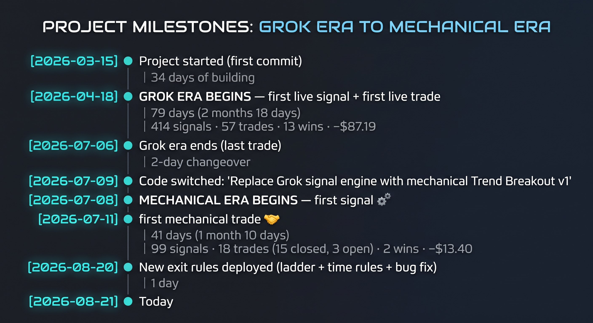

# HyperEater — The Complete Rulebook

## First, one word you need: **R**

**R = the money you agree to lose if the trade goes wrong.**

If you decide "I'm willing to lose $3 on this trade," then **1R = $3** for that trade.

- Trade makes $6? That's **+2R**
- Trade loses $3? That's **−1R**

Everything below is measured in R, because it lets you compare a $56 ZEC trade with a $500 Bitcoin trade fairly.

---

## What the bot is actually trying to do

Most of the time, prices wobble sideways and go nowhere. Once in a while, a coin starts a **big long run** and moves a very long way.

Nobody can predict when. So the bot doesn't try. Instead:

1. Take lots of **small, cheap bets** when a coin starts moving
2. Most fail → lose a small, known amount → move on
3. A few turn into big runs → **stay in and ride them for weeks**

> **Most trades lose. That's the plan, not a bug.** Roughly 1 in 3 wins, but the winners are much bigger than the losers.

---

## The playing field

**21 coins it's allowed to touch:**

`BTC` `ETH` `HYPE` `SOL` `ZEC` `XRP` `NEAR` `PUMP` `AAVE` `FARTCOIN` `SUI` `XPL` `WLD` `DOGE` `BNB` `BCH` `ADA` `VVV` `ENA` `MON` `TAO`

**The clock:** the bot works in **4-hour blocks**. It wakes up 2 minutes after each block ends and checks all 21 coins.

Blocks end at **00:00, 04:00, 08:00, 12:00, 16:00, 20:00 UTC**.

---

# PART 1 — Deciding to buy

### Rule 1 · Which way is the coin going?

The bot draws two lines on the chart: the **average price of the last 50 blocks**, and the **last 200 blocks**.

| What it sees | What it means | What it's allowed to do |
|---|---|---|
| Price above the 200-line, **and** 50-line above 200-line | Going **up** | **Only buy** |
| Price below the 200-line, **and** 50-line below 200-line | Going **down** | **Only sell short** |
| Anything mixed | No clear direction | **Do nothing** |

> **Why:** it never bets against the direction things are already moving.

### Rule 2 · Wait for it to break new ground

Being in an uptrend isn't enough. The bot waits until the price closes **higher than it has been for the last 55 blocks** — that's about **9 days**.

Going up? → must close above the **highest price of the last 9 days**
Going down? → must close below the **lowest price of the last 9 days**

> **Why:** doing something it couldn't do for 9 days is the footprint of a real move starting.

### Rule 3 · Don't chase

If the price has **already run far past** that breakout point, the bot skips it. The move is already gone.

"Far past" = more than **half a normal candle's size** beyond the line.

It checks this **twice** — once when the signal appears, and again right before actually placing the order, in case price ran away in between.

---

# PART 2 — How much money to put in

### Rule 4 · Where the safety stop goes

The bot measures the coin's **normal step size** (how much it typically moves in one 4-hour block). Then it puts the stop **2 normal steps away** from the entry price.

- Calm coin → tight stop
- Wild coin → wide stop

> **Why:** the stop sits outside normal noise for *every* coin, without you having to guess.

### Rule 5 · The bet size

**The bot risks 3% of the account on every trade.**

Important: 3% is **what it can lose**, not what it puts in.

The bot works backwards:
> *"If I'm willing to lose $3, and my stop is 5% away, then I should buy $60 worth."*

Because it's a **percentage of the current balance**, the dollar amount shrinks automatically when you're losing. 10 losses in a row costs about 26% of the account, not 30%. **A losing streak can never wipe you out.**

### Rule 6 · The size ceiling

A position can never be worth more than **100% of your account value**, no matter what the math says.

*(It uses 20x leverage but only commits 5% of the account as margin — 5% × 20 = 100%.)*

### Rule 7 · Don't be too big for the room

If not many people are buying and selling that coin right now, the bot **shrinks the position** so it can always get out cleanly.

Limit: never more than **a quarter** of the visible orders on the book.

---

# PART 3 — Getting in

### Rule 8 · Maximum 3 trades at once

Never more than **3 open positions**, and **never two on the same coin**.

### Rule 9 · Avoid the fee moment

The exchange charges a fee at **00:00, 08:00 and 16:00 UTC**. The bot won't open a trade within **30 minutes** of those times.

It **waits** for the window to pass — it doesn't cancel the trade.

### Rule 10 · How the order is placed

1. Places a normal order at the current price
2. If nobody fills it within **30 seconds** → takes whatever price is available
3. **The moment the trade exists, the stop-loss is placed at the exchange**

> **Why that last part matters:** the stop lives *at the exchange*, not inside the bot. If your server dies, your internet dies, or the bot crashes — **your stop still works.**

**There is no take-profit order.** Deliberately. See Part 4.

---

# PART 4 — Getting out

There are exactly **four** ways a trade ends.

### 🚪 Exit 1 · The stop is hit

The move failed. Lose about **1R**. This is the most common ending and it's completely fine.

### 🚪 Exit 2 · The ratchet ladder

As the trade makes money, the stop **climbs up behind it**. It **only ever moves up — never back down.**

| Price climbs to | Stop jumps to | You now can't make less than |
|---|---|---|
| **+0.8R** | +0.5R | **+0.5R** |
| **+2.5R** | +1R | **+1R** |
| **+3.5R** | +2R | **+2R** |
| **+4.5R** | +3R | **+3R** |
| **+5.5R** | +4R | **+4R** |
| **+6.5R** | +5R | **+5R** |
| **+7.5R** | +6R | **+6R** |

The rule behind it: **the stop trails 1.5R behind** — except the first step, which trails only 0.3R.

> **Tight at the bottom** → most trades die young, so grab *something*.
> **Loose at the top** → a real run must not get shaken out by a normal dip.

**This is not a take-profit.** It never closes you when price goes **up** — only when price comes **down**. Your upside stays unlimited.

### 🚪 Exit 3 · The reason disappeared

If the trend (Rule 1) flips **fully to the opposite direction**, the bot closes immediately at market.

> **Why:** you bought because it was going up. It's now going down. The reason is gone.

### 🚪 Exit 4 · It's not going anywhere

Three separate patience rules. **A trade is never punished for being old — only for being slow.**

**4a · Gave it back**
Was up **1.25R or more**, and has now sunk to **38% or less** of its best point → close it.

*Example: went to +2.2R, now at +0.8R → done.*

**4b · The 3-day check** *(20 blocks)*
Not up at least **+0.8R** by now? → close it.

**4c · The 8-day check** *(50 blocks)*
Not up at least **+1.8R** by now? → close it.

> **Why the bar rises:** you only have 3 slots. A trade sitting flat for a week is blocking a slot that could hold the next big run.
>
> ⚠️ **There is no "close after X days" rule** — on purpose. The best trade ever tested ran **132 days**. If a trade is genuinely climbing, it's left alone forever.

---

# PART 5 — The safety net

### Rule 11 · The guard checks every 10 minutes

Every 10 minutes, on every open trade, the bot confirms **the stop order still exists at the exchange**. If it's missing, it puts it back.

If it **cannot** place a stop for any reason → it **closes the position immediately**. It will never knowingly hold a position with no stop.

### Rule 12 · Size double-check

If a fill comes back **bigger than intended** (which can happen in fast markets), the bot **immediately sells off the extra** so your real risk matches your planned risk.

It also has protection against accidentally opening the trade **twice** if an order fills at the same moment it's being cancelled.

### Rule 13 · The emergency brake

| Scope | Trigger | What happens |
|---|---|---|
| One coin + direction | Last **6** trades add up to **−5.5R** | That combo benched **24 hours** |
| Whole account | Last **15** trades add up to **−14R** | **Everything pauses 48 hours** |

Scratches and breakevens don't count — only losses worse than −0.5R.

> ⚠️ **These are set deliberately WIDE.** Normal losing streaks of 5–8 trades are expected and will **not** trip them. This brake exists to catch a **malfunction** — broken data, runaway re-entry — not to stop a bad week.

---

# 📋 The whole thing on one page

| Setting | Value |
|---|---|
| Coins watched | 21 |
| Chart timeframe | 4 hours |
| Trend lines | 50 and 200 blocks |
| Breakout window | 55 blocks (~9 days) |
| Don't-chase limit | 0.5 × normal candle size |
| Stop distance | 2 × normal candle size |
| **Risk per trade** | **3% of account** |
| Max position value | 100% of account |
| Leverage | 20x cross |
| Max order book share | 25% |
| **Max open trades** | **3** (one per coin) |
| No-trade window | ±30 min of 00:00 / 08:00 / 16:00 UTC |
| Order fill wait | 30 seconds, then market |
| Take-profit | **none** — by design |
| **Ratchet ladder** | **0.8→0.5, 2.5→1, 3.5→2, 4.5→3, 5.5→4, 6.5→5, 7.5→6** |
| Give-back exit | peaked ≥1.25R, fell to ≤38% of peak |
| 3-day check | must be ≥ +0.8R |
| 8-day check | must be ≥ +1.8R |
| Hard time limit | **none** — by design |
| Stop-order guard | every 10 minutes |
| Coin brake | 6 trades ≤ −5.5R → 24h bench |
| Account brake | 15 trades ≤ −14R → 48h pause |

---

## 🎯 The whole strategy in five sentences

1. Only bet **with** the direction things are already moving.
2. Enter when a coin does something it **couldn't do for 9 days**.
3. Risk a **small, fixed slice** every time, so no single loss matters.
4. **Cut the failures fast** — by stop, by trend flip, or for being too slow.
5. **Never cut the winners** — just keep raising the floor beneath them.

> Most trades will lose small. A few will win big. **The big ones pay for everything.**

